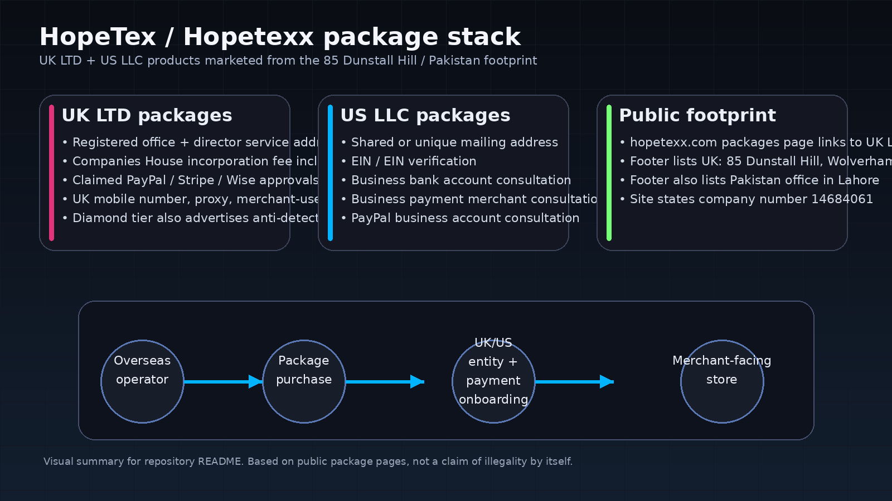
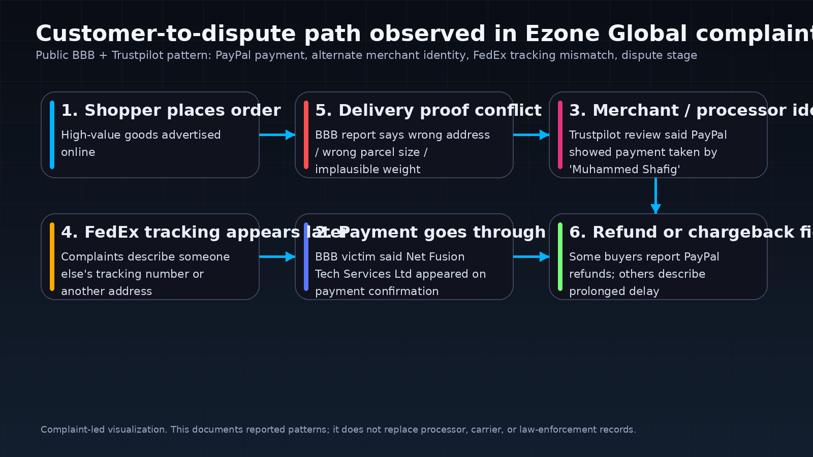
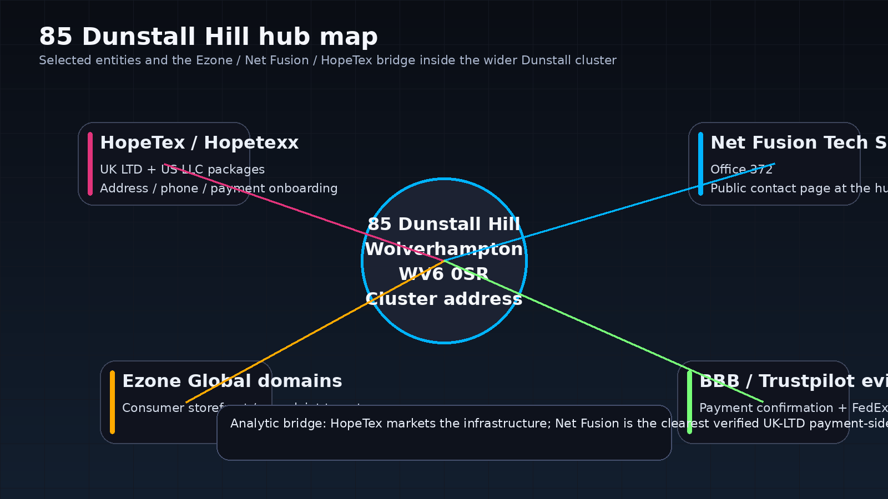

# Project Dunstall Mirror

A standard residential property used as a registered office address for 900+ UK Limited companies, representing a high-density corporate-registration cluster with possible relevance to formation-agent infrastructure, payment-enablement pathways, and cross-border ecommerce operations.

## Visual Reference: 85 Dunstall Hill Registration Density

[Wolverhampton (85 Dunstall Hill) 900+ companies](https://maps.app.goo.gl/bLjkbWQQFpMRRu6L9)

**Conceptual illustration:**

The visualization highlights:

- mailbox-style corporate presence
- stacked “virtual office” identity layering
- registry-level scaling beyond physical capacity
- separation between **legal registration footprint** and **operational footprint**

This pattern is consistent with:

- formation-agent address hosting
- nominee / proxy director infrastructure
- merchant-of-record abstraction layers
- cross-border payment-rail access packaging
- **mobile-number / SIM provisioning pathways**
- **UK telecom-linked onboarding support**
- **phone-verification infrastructure for merchant and fintech accounts**
- **ACSP / verifier note:** From the Companies House materials reviewed, is that HopeTex has acted in a corporate services / verification capacity in relation to other entities.
---

## OSINT Interpretation Layer

The address functions as a **corporate identity aggregation point**, enabling:

foreign operator identity  
→ UK registered entity  
→ address hosting  
→ **UK mobile number / SIM access**  
→ payment processor onboarding  
→ merchant storefront deployment  
→ dispute-stage delivery evidence handling

Such hubs commonly appear in:

- fintech onboarding pathways
- remote-operator ecommerce structures
- cross-jurisdiction freelancer payment bridges
- high-volume incorporation service pipelines
- **SIM-backed account verification chains**

Observed entity types:

- IT services
- SEO agencies
- logistics shells
- ecommerce operators
- formation intermediaries
- payment-linked service entities
- telecom / SIM provisioning nodes
- shipping-label generation intermediaries
- carrier-account-enabled fulfillment brokers

---

## Mobile / SIM Layer

A relevant supporting layer in this model is the use of **UK mobile phone numbers and SIM-linked verification**, especially where package offerings explicitly mention:

- UK mobile number
- physical SIM or eSIM
- phone-based onboarding support
- account verification assistance

Analytically, this may intersect with:

- **O2 and other mobile phone / telecom retail channels**
- SIM resellers
- handset / phone shops
- prepaid number acquisition
- OTP / SMS verification infrastructure

This does **not** by itself prove misuse by any specific telecom provider or shop.  
It should be read as an **infrastructure hypothesis** tied to the role of UK-number availability in merchant-account setup, payment verification, and account recovery flows.

---

## Dataset Indicator

Current cluster observation:

- **Address:** 85 Dunstall Hill
- **Location:** Wolverhampton, UK
- **Estimated registrations:** 900+

Observed entity types:

- IT services
- SEO agencies
- logistics shells
- ecommerce operators
- formation intermediaries
- payment-linked service entities
- **mobile phone / telecom support entities**
- **SIM-linked verification or phone-number service nodes**

---

## Ezone Global / HopeTex / Net Fusion update

**Release target:** `v2026.04.01-ezone-hopetex-update`  
**Repository:** `RE3CON/Project-Dunstall-Mirror`  
**Prepared for manual upload**

This update packages a conservative, source-led case study on the bridge between:

- the **HopeTex / Hopetexx** formation-and-payments offer stack
- **Net Fusion Tech Services Limited** at **Office 372, 85 Dunstall Hill**
- **Ezone Global** complaint data
- repeated **FedEx-linked delivery-evidence disputes** described in public buyer reports

---

## What is new in this update

- A fresh PDF case study: `Project_Dunstall_Mirror_Ezone_HopeTex_Bridge_Report_2026-04-01.pdf`
- A relationship matrix CSV: `ezone_hopetex_bridge_relationship_matrix_2026-04-01.csv`
- An enriched cluster CSV: `85_Dunstall_Hill_COMPLETE_OSINT_merged_UPDATED_2026-04-01_ezone_manual_upload.csv`
- Three new visual assets for the repo README:
  - `hopetex_package_stack.png`
  - `ezone_customer_flow.png`
  - `wolverhampton_hub_map.png`

---

## Key findings

### 1) HopeTex / Hopetexx publicly markets entity + onboarding infrastructure

The public package pages show two linked tracks:

- **US LLC packages** on `hopetexx.com/packages`, including:
  - registered agent
  - mailing address
  - EIN
  - business bank account consultation
  - business payment merchant consultation
  - PayPal business account consultation

- **UK LTD packages** on `hopetex.co.uk/product-category/packages/`, including:
  - Companies House fee included
  - registered office + director service address
  - company authentication code + UTR
  - UK mobile number
  - claimed PayPal / Stripe / Wise approvals
  - merchant-use guidance
  - in higher tiers, proxy / anti-detect tooling

### 2) Net Fusion is the clearest verified UK-LTD bridge

Public records place **Net Fusion Tech Services Limited** at:

> Office 372, 85 Dunstall Hill, Wolverhampton, England, WV6 0SR

That address appears both in Companies House and on the company's public contact page.

### 3) The cleanest Ezone payment bridge is complaint-based, but concrete

A BBB Scam Tracker report for **Ezone Global** states that the buyer paid through **PayPal** and that **Net Fusion Tech Services Limited** appeared on the payment confirmation.

This is the strongest current public bridge between:

- a consumer-facing Ezone storefront
- a real UK limited company inside the Dunstall Hill cluster

### 4) FedEx appears repeatedly in the dispute phase

Trustpilot and BBB complaint material describes a recurring pattern where buyers say they received:

- someone else's tracking number
- delivery to another address
- a proof-of-delivery image that did not match the expected item
- or a package weight that looked implausible for the product ordered

That supports a narrow, evidence-led statement:  
**delivery evidence is repeatedly disputed and appears central to the refund / chargeback stage.**

---

## Visuals

### HopeTex package stack

### Ezone customer flow

### Wolverhampton hub map

---

## Evidence ladder

### Verified public facts

- HopeTex / Hopetexx package pages advertise UK LTD and US LLC formation products with payment-related consultation and onboarding language.
- Hopetexx publicly lists a UK presence at **85 Dunstall Hill, Wolverhampton WV6 0SR**.
- Net Fusion Tech Services Limited is a real UK company at **Office 372, 85 Dunstall Hill**.
- Trustpilot hosts a current `ezoneglobal.us` page with 30 reviews and a 1.5 / 5 TrustScore.
- BBB complaint **1199897** states that **Net Fusion Tech Services Limited** appeared on an Ezone Global payment confirmation.
- BBB complaint **1236472** describes a wrong-address / wrong-weight / wrong-parcel FedEx pattern.

### Complaint-based findings

- PayPal payment reportedly confirmed to **"Muhammed Shafig"** in one Trustpilot complaint.
- Buyers repeatedly describe:
  - fake or mismatched FedEx tracking
  - different delivery addresses
  - unresponsive support

### Low-confidence / watchlist findings

- `Ezone Supply Partners Limited` appears in the cluster CSV by name, but no direct public bridge to `ezonesglobal` was verified in this pass.
- The broader thesis of a single centrally managed fraud stack remains an analytic hypothesis unless reinforced by processor, carrier, court, or law-enforcement records.

---

## Files in this update

| File | Purpose |
|---|---|
| `Project_Dunstall_Mirror_Ezone_HopeTex_Bridge_Report_2026-04-01.pdf` | Case study PDF |
| `ezone_hopetex_bridge_relationship_matrix_2026-04-01.csv` | Focused evidence matrix |
| `85_Dunstall_Hill_COMPLETE_OSINT_merged_UPDATED_2026-04-01_ezone_manual_upload.csv` | Enriched cluster CSV |
| `RELEASE_NOTES_v2026.04.01-ezone-hopetex-update.md` | Release text |
| `assets/*.png` | README visual assets |

---

## Identity Laundering Pipeline: Global Demand Nodes

OSINT mirroring suggests a recurring pipeline where the Dunstall Hill hub functions as a **processing node**, converting foreign operator demand into **verified UK/US entities** that bridge a financial-access gap.

| Demand Node | Primary Barrier | Typical Formation-Service Solution |
|---|---|---|
| Pakistan | No PayPal / limited Stripe availability | “UK Ltd + Verified PayPal” (often marketed via offshore software-house intermediaries such as Jhang-based setups) |
| Nigeria | Restricted PayPal receiving / high-risk IP reputation | “UK SIM + UK Virtual Office + UK merchant identity” |
| Bangladesh | No PayPal Business access | “UK Agency Status” for international contract bidding and Stripe billing |
| Egypt | Foreign-currency controls + outbound transfer restrictions | “UK fintech banking (GBP) + merchant entity mirror” |

---

## Infrastructure Role Model by SIC / Function

| Layer | Primary SIC Code | Role in Infrastructure |
|---|---:|---|
| Retail Facade | 47910 | Public-facing storefronts like `ezonesglobal.com`, used to establish merchant accounts |
| Logistics Node | 52290 | Shipping / transport-support structures relevant to tracking and delivery-evidence disputes |
| Technical Hub | 63120 | Portal development and hosting infrastructure |
| Payment Buffer | 62020 | Centralized fee-handling or IT-service billing layers |
| Compliance Shield | 69201 | Verification / accounting-style structures that can support trust presentation |
| Content Node | 73110 | SEO, review shaping, and brand-noise generation |

---

## Case Study: The eZone Global Infrastructure

The **eZone** brand (including `ezonesglobal.com`, `ezonesglobal.us`, and `ezoneglobal.com`) appears in this project as a consumer-facing case study linked by complaint material, payment references, and repeated logistics disputes.

### Retail dispute pattern and weight anomalies

Victims report ordering high-value equipment—such as snow blowers or gas ranges—that was allegedly never properly delivered. A recurring complaint pattern involves carrier data that buyers say does not match the item ordered.

Analytic focus:

- implausible parcel weights
- zip-code-level delivery proofs that do not match the buyer's address
- wrong-address or wrong-parcel outcomes
- dispute systems relying heavily on carrier event data

### Recruitment-scam line: eZone Staffing

The group also appears in reports involving **eZone Staffing**, targeting professionals on platforms such as LinkedIn and Monster. Reported behavior includes:

- use of Western aliases
- accent / geography mismatch claims from targets
- requests for resumes in editable Microsoft Word format
- concerns that submitted credentials may be reused or altered

These points remain **complaint-based** unless independently verified.

---

## Anchor Node Analysis: The HopeTex Verification Loop

A central analytic hypothesis in this project is that **HopeTex Limited** functions as a trust-conversion node within the wider cluster by combining:

- incorporation support
- address services
- identity-verification pathways
- payment / merchant setup language
- UK mobile-number access

### Key verified personnel mentioned in public filings reviewed in this project

- Arbab Arbab
- Arifa Rehan
- Munir Ahmed
- Muhammad Saad Abbasi

These names are retained here as investigation-relevant filing references, not as standalone allegations of misconduct.

---

## Priority Investigative Nodes

| Office | Entity Name | SIC Code | Priority | Hypothesis / Review Note |
|---:|---|---:|---|---|
| Hub | HopeTex Limited | 82990 | CRITICAL | Master identity / onboarding node; possible ACSP-linked trust-conversion role |
| 372 | Net Fusion Tech Services | 62020 | CRITICAL | Strongest public payment bridge tied to Ezone complaint material |
| 178 | Geek Axon Ltd | 63120 | HIGH | Technical support / portal infrastructure candidate |
| 7777 | Friend Formation Ltd | 69201 | HIGH | Administrative / filing buffer candidate |
| 695 | Ezone Supply Partners | 47910 | HIGH | Retail-front watchlist link; direct bridge not fully verified in this pass |
| 8 | Zingo Writers Ltd | 73110 | MEDIUM | Content / SEO / review-management relevance |
| 228 | 24/7 Support Private Ltd | 82990 | MEDIUM | Administrative timing / delay relevance noted in review history |

---

## Strategic Conclusion

The Dunstall Hill infrastructure appears, at minimum, to be a high-density **corporate-hosting and enablement environment**. The strongest current bridge in open sources is not a full network proof, but a narrower chain:

- **HopeTex / Hopetexx** markets formation + onboarding pathways
- **Net Fusion Tech Services Limited** is verifiably located at **85 Dunstall Hill**
- **Ezone Global** complaint material references **Net Fusion** in payment context
- **FedEx-linked delivery disputes** recur in the complaint stage

That does **not** by itself prove a unified centrally managed fraud syndicate across the entire address. It does, however, justify continued focus on anchor nodes rather than only disposable storefront domains.

---

## Working note

This update intentionally separates:

- **open-web facts**
- **user / victim complaint evidence**
- **analytic inference**

That keeps the repo useful for OSINT while reducing the risk of presenting complaint narratives as fully adjudicated fact.

---

## About

## Visualization

